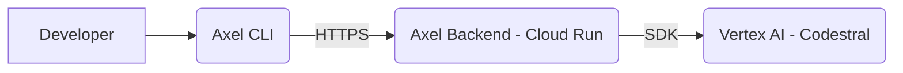

# Axel: Coding Assistant with Vertex-Mistral Integration

Axel is a powerful coding assistant built to leverage the **Vertex-Mistral partner integration**, specifically tailored for **Codestral**. It features a clean, model-agnostic architecture that allows for seamless server-side model swaps via configuration.

## Project Architecture

Axel is split into two main components:

1.  **Axel Backend**: A FastAPI application designed for deployment on **GCP Cloud Run**. It abstracts the model layer, exposing stable endpoints for chat and code completion.
2.  **Axel CLI**: A lightweight Python-based command-line interface that communicates with the backend, providing developer tools directly in the terminal.



## Key Features

- **Model Agnostic**: Swap models (e.g., Codestral versions) on the backend without changing a single line of client-side code.
- **FIM (Fill-In-the-Middle)**: Specialized endpoint for high-context code completions.
- **Cloud Native**: Optimized for GCP Cloud Run with dynamic port handling and minimal build footprints.

## Getting Started

### Backend Setup

The backend serves as the bridge between the CLI and Vertex AI.

1.  **Configure Environment**:
    Update `backend/.env.cloudrun` with your GCP details:
    ```bash
    GOOGLE_CLOUD_PROJECT_ID=your-project-id
    GOOGLE_CLOUD_REGION=us-central1
    ```

2.  **Deploy to Cloud Run**:
    ```bash
    cd backend
    ./deploy.sh
    ```

### CLI Setup

1.  **Install Dependencies**:
    ```bash
    cd cli
    pip install .
    ```

2.  **Usage**:
    ```bash
    # Code chat
    axel chat --temperature 0.2

    # Code completion (FIM)
    axel fim --prompt "def hello():" --suffix "return 'world'"
    ```

## Project Structure

```text
axel/
├── backend/            # FastAPI Backend
│   ├── app/            # Core logic
│   ├── Dockerfile      # Cloud Run config
│   └── deploy.sh       # Deployment script
├── cli/                # Python CLI
│   ├── axel/           # CLI source code
│   └── pyproject.toml  # Installation config
└── axel-desing.md      # Original design document
```

## Technologies Used

- **Python**: Core logic for both CLI and Backend.
- **FastAPI**: High-performance backend framework.
- **Mistral Google Cloud SDK**: Native integration with Codestral on Vertex AI.
- **GCP Cloud Run**: Scalable, serverless hosting.
- **Docker**: Containerization for consistent deployments.
