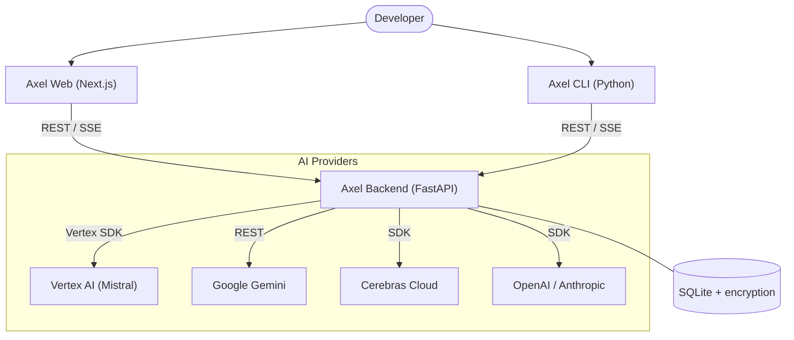

# ⚡ Axel — The AI Coding Assistant for Cloud Native Teams

[](https://github.com/Axelfernandes/axel_cli/blob/main/LICENSE)
[](https://fastapi.tiangolo.com/)
[](https://nextjs.org/)
[](https://cloud.google.com/run)

Axel is a premium, model-agnostic AI coding assistant designed for modern development workflows. It integrates deeply with **GCP Vertex AI** (Mistral/Codestral) while providing a unified interface for **Cerebras**, **Anthropic**, **Gemini**, and **OpenAI**.

---

## ✨ Key Features

- 🌓 **Modern Dashboard**: A sleek, high-performance web interface built with Next.js and Tailwind CSS.
- 💻 **Monaco Editor**: Full-featured code editing experience with syntax highlighting for dozens of languages.
- ⚡ **Ultra-Fast Streaming**: Real-time token streaming via SSE for a responsive chat experience.
- 🔒 **Secure-by-Design**: Professional-grade Fernet encryption for all stored API keys.
- 🤖 **Provider Flexible**: Built-in support for Cerebras (llama3.1-8b), Vertex AI (Codestral), Gemini 1.5/2.0, Claude 3.5, and GPT-4o.
- ☁️ **Cloud Native**: Optimized Docker configurations for zero-config deployments to GCP Cloud Run.

---

## 🏗️ Architecture

Axel is architected for scalability and separation of concerns.



---

## 🚀 Getting Started

### 1. Backend Setup
The heart of Axel. Handles encryption, session management, and AI provider abstraction.

```bash
cd backend
# 1. Update .env.cloudrun with your keys
# 2. Deploy instantly
./deploy.sh
```

### 2. Web Dashboard
A premium web interface for browsing repositories and chatting with models.

```bash
cd axel-web
npm install
npm run dev -- --port 3501
```

### 3. Terminal CLI
For the minimalists. Access Axel's brain directly from your shell.

```bash
cd cli
pip install .
axel chat
```

---

## 📂 Project Structure

| Directory | Purpose |
| :--- | :--- |
| `backend/` | FastAPI service, DB models, and AI client logic. |
| `axel-web/` | Next.js frontend with Monaco editor & streaming chat. |
| `cli/` | Lightweight Python CLI for terminal-based interactions. |

---

## 🛠️ Tech Stack

- **Frontend**: Next.js 14, Tailwind CSS, Monaco Editor, React Hot Toast.
- **Backend**: FastAPI, SQLAlchemy, Pydantic, cryptography (Fernet).
- **Hosting**: GCP Cloud Run (Backend), Vercel (Frontend).
- **APIs**: GitHub API, Vertex AI, Cerebras, Google GenAI (REST).

---

<div align="center">
  <sub>Built with ❤️ by the Axel Team</sub>
</div>
